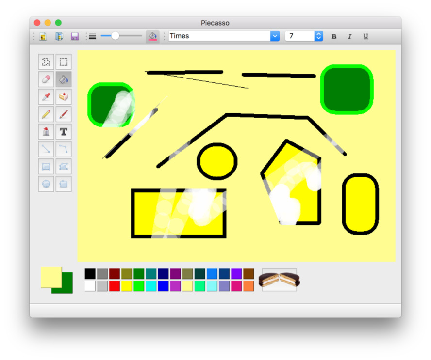
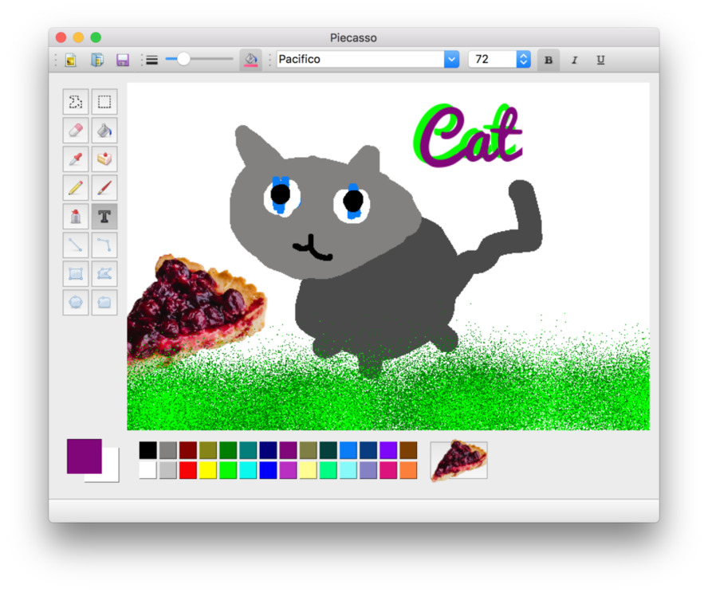

# Piecasso — A desktop Paint application in PyQt

Express yourself with PieCasso, the only painting programme to feature
ready made pictures of pie.

Piecasso is a clone of the Paint programme from Windows 95 (ish) with a
few additions (and subtractions). The programme features standard
tools including pen, brush, fill, spray can, eraser, text and a number of
shapes. 

You can copy from the image, with a custom shape,
although pasting + floating is not supported. The canvas is a fixed size
and loaded images are adjusted to fit. A stamp tool is also included
which is pre-loaded with pictures of delicious pie.

> If you think this example app is neat and want to learn more about
PyQt in general, [take a look at my ebook & online course
"Create Simple GUI Applications"](https://martinfitzpatrick.name/create-simple-gui-applications)
which covers everything you need to know to start building your own applications with PyQt.

## Code notes

### Event handling

All tools are implemented with nested event handlers, which forward
on events as appropriate. This allows for a lot of code re-used between
tools which have common behaviours (e.g. shape drawing). Adding the select
region animation requires a timer (to update the crawling ants) which
added some complexity.

### Flood fill

This was the trickiest part of this app from a performance point of view.
Checking pixels directly is far too slow (full-canvas fill
time of approx 10 seconds). Most code to achieve this in Python sensibly
uses numpy, but I didn't want to introduce a dependency for this alone.

By exporting the image as a bytestring, then down-sampling to a boolean 
byte-per-pixel (for match/no-match) to simplify the comparison loop, I
could get it up to a reasonable speed.

The search-to-fill algorithm is still pretty dumb though.

